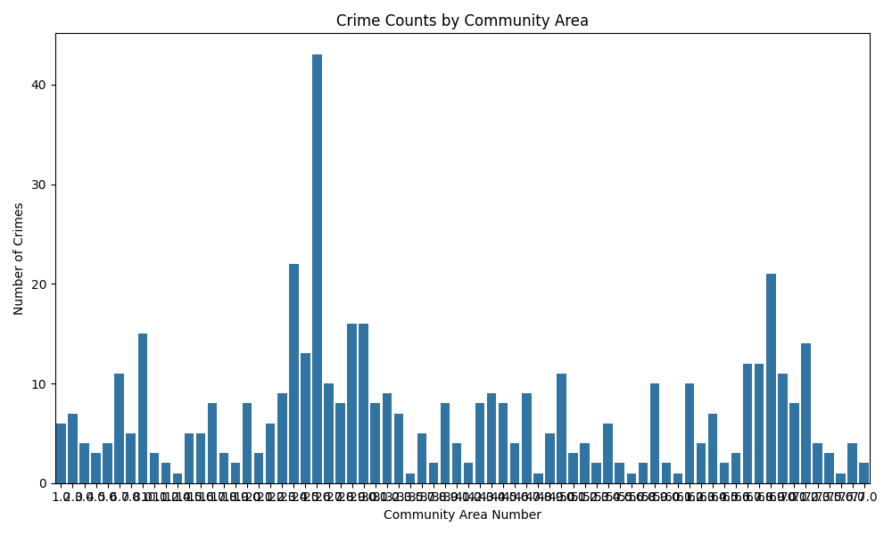
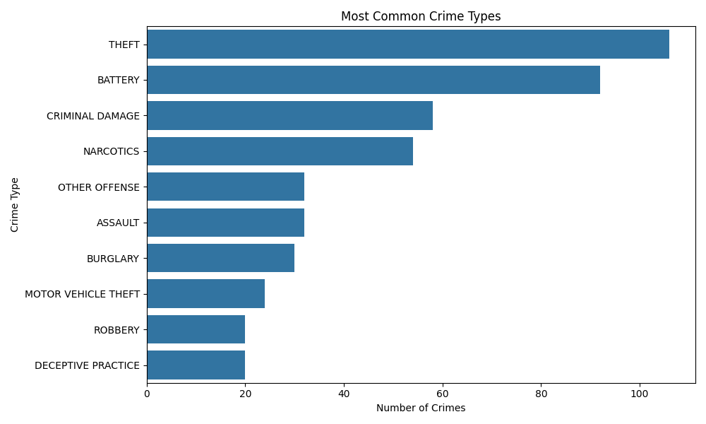
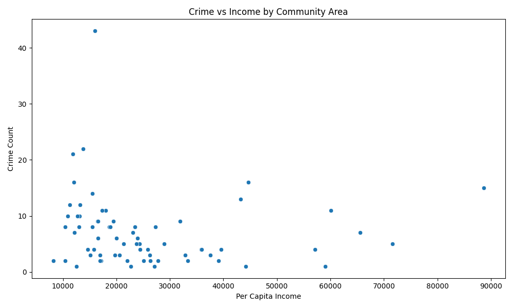

# Chicago Crime Analysis (SQL + Python)
Analysis of Chicago crime and socioeconomic datasets using SQL and Python.

## Introduction
This project uses SQL queries and Python data analysis to investigate crime patterns 
in Chicago, exploring relationships between crime rates, crime types and Community Areas.

## Questions of Interest
- Which communities experience the highest and lowest crime rates?
- What types of crimes occur most frequently?
- Is there a relationship between crime rates and per capita income?

## Data Sources
The project uses subsets of two datasets from the City of Chicago's
data portal. 

### Chicago Crime Data
This dataset looks at reported crimes, including 
types of crime and Community Areas in which they occurred.

### Socioeconomic Indicators in Chicago
This dataset contains information on six socioeconomic indicators
for each Community Area, including per capita income.

## Exploratory Data Analysis
Initial investigation of the data was conducted using SQL queries to explore 
the datasets and identify relationships between
crime and Community Areas.

Python (pandas) was then used to produce visualisations of the relationships found from the queries using seaborn and matplotlib.

## Visualisations

### Crime by Community Area

### Most Common Crime Types

### Crime vs Income

## Key Findings
Crime rates differ dramatically by Community Area. There is   
a large spike in crime rates in Austin, which is then followed by 
Humboldt Park and Englewood. The communities 
with the lowest crime rates are Forest Glen, Near South Side,
Hegewisch, Burnside and Bridgeport.

The most common types of crime reported in Chicago are theft
and battery. These together account for 37.15% of all
crime in Chicago.

Community Areas with lower per capita income tend to experience
higher crime rates, whereas Community Areas with higher per capita
income tend to experience lower crime rates. 
The Community Area with the highest crime rate, Austin, has 
a per capita income of 15,957, compared to the Community Area with 
the lowest crime rate, Forest Glen, with a per capita income 
of 44,164. However, there is not a perfectly linear relationship and 
the data has considerable variability.

